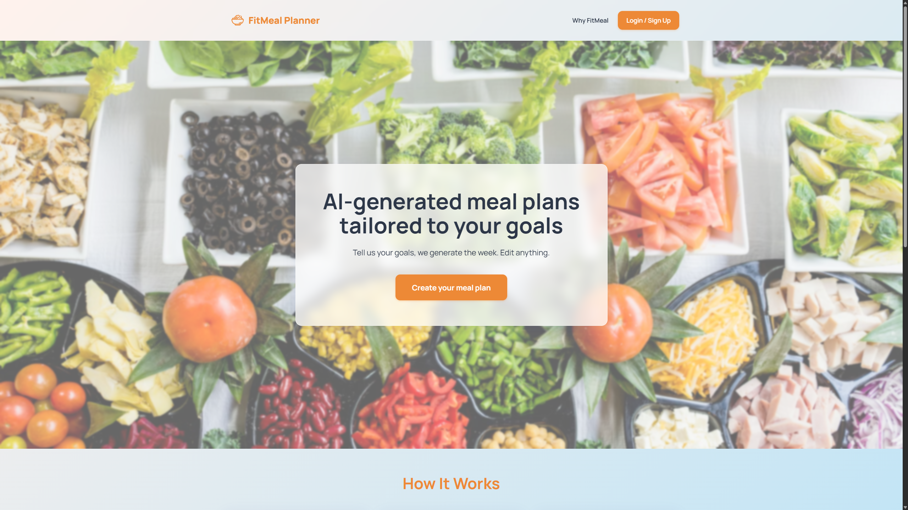

# FITMeal Planner

FITMeal Planner is an intelligent, AI-powered web application designed to help users generate personalized weekly meal plans. By leveraging the power of Large Language Models (LLMs) via the Groq API, FITMeal creates tailored nutrition plans based on individual goals, dietary restrictions, and culinary preferences.

## 🚀 Features

- **AI-Powered Meal Generation**: Generates complete 7-day meal plans based on user inputs.
- **Personalized Preferences**: Supports customization for:
  - Fitness Goals (e.g., Weight Loss, Muscle Gain)
  - Dietary Types (e.g., Vegan, Keto, Paleo)
  - Allergies & Exclusions
  - Cuisine Preferences
  - Meals per day
- **Interactive Planner UI**:
  - Modern "Glassmorphism" design with an Orange/Food-themed aesthetic.
  - Carousel view for navigating through the week's meals.
  - Detailed recipe modals with ingredients, instructions, and macro-nutrient breakdowns.
- **User Accounts**: Secure login and registration system.
- **Plan Management**:
  - Save generated plans.
  - "Regenerate" option to get a fresh plan.
- **Favorites System**: Save individual recipes to your profile for quick access.
- **Profile Management**: Update personal stats (Age, Weight, Height, Activity Level).
- **Mobile Testing QR Code**: Profile page shows a QR code pointing to your machine's local IP so you can open the app on phones/tablets on the same network.

## 🛠️ Tech Stack

- **Backend**: Python, Flask
- **Database**: SQLite
- **Frontend**: HTML5, CSS3 (Custom Glassmorphism), JavaScript (Vanilla)
- **AI Integration**: Groq API (using `openai/gpt-oss-120b` or similar models)

## 📦 Installation

1. **Clone the repository**
   ```bash
   git clone https://github.com/Leo00703/FITMeal.git
   cd FITMeal
   ```

2. **Create a Virtual Environment**
   ```bash
   # Windows
   python -m venv .venv
   .venv\Scripts\activate

   # macOS/Linux
   python3 -m venv .venv
   source .venv/bin/activate
   ```

3. **Install Dependencies**
   ```bash
   pip install -r requirements.txt
   ```
   Key runtime deps: Flask, python-dotenv, Groq, qrcode[pil], Pillow.

4. **Environment Configuration**
   Create a `.env` file in the root directory and add your API keys:
   ```env
   GROQ_API_KEY=your_groq_api_key_here
   SECRET_KEY=your_secret_key_here
   ```

5. **Initialize Database**
   The application automatically initializes the SQLite database (`fitmeal.db`) on the first run.

## 🏃‍♂️ Usage

1. **Run the Application**
   ```bash
   python app.py
   ```

2. **Access the App**
    - **Localhost**: Open your browser and navigate to `http://127.0.0.1:5000`.
    - **Local Network (Mobile Testing)**:
       1. Find your computer's local IP address (`ipconfig` on Windows, `ifconfig` on macOS/Linux).
       2. On your mobile device connected to the same WiFi, navigate to `http://<YOUR_IP_ADDRESS>:5000`.
       3. On the Profile page, scan the autogenerated QR code labeled “Mobile Testing” — it encodes `http://<your_local_ip>:5000` dynamically so you can open the app on another device without typing the address.

3. **Get Started**
   - Register for a new account.
   - Navigate to the Planner.
   - Fill in your preferences and click "Generate Plan".
   - View your personalized weekly meal plan!

## 📂 Project Structure

```
FITMeal/
├── app.py              # Main Flask application entry point
├── ai_service.py       # AI integration logic (Groq API)
├── database.py         # Database connection and helper functions
├── LICENSE             # Apache 2.0 license
├── utils.py            # Helper functions and mock data
├── requirements.txt    # Python dependencies
├── TECHNICAL_DOCUMENTATION.md # Detailed technical docs
├── static/
│   └── styles.css      # Global styles and themes
├── templates/          # HTML Templates (Jinja2)
│   ├── base.html       # Base layout
│   ├── index.html      # Landing page
│   ├── plan.html       # Weekly planner view
│   ├── planner_form.html # Preferences form
│   ├── profile.html    # User profile and favorites
│   └── ...
└── fitmeal.db          # SQLite Database (generated)
```

## 📚 Documentation

For a detailed technical overview of the project architecture, database schema, and logic flow, please refer to the [Technical Documentation](TECHNICAL_DOCUMENTATION.md).

## 📄 License

Licensed under the Apache License 2.0. See the [LICENSE](LICENSE) file for details.
